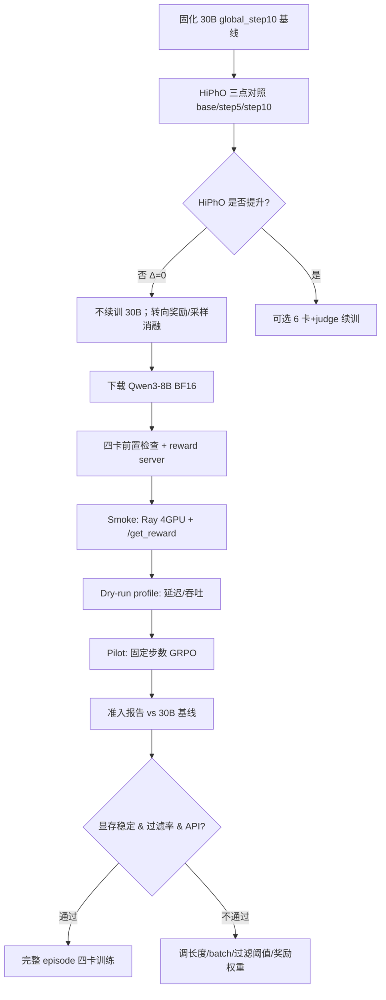

# 四卡 GRPO 训练报告（2026-07-15）

> 本文档记录 PhysicsVerifier + OpenRLHF 路径下，从 **Qwen3-30B 六卡试验** 到 **Qwen3-8B 四卡生产路径** 的设置、流程、结果与后续方向。  
> 对应方案：`four-gpu-grpo-design`（四卡 GRPO 训练优化方案）。

---

## 1. 背景与目标

### 1.1 为什么切到四卡 8B

| 约束 | 30B 六卡路径 | 四卡 8B 目标路径 |
|------|-------------|-----------------|
| GPU 预算 | 6 卡训练 + 1 卡本地 judge | **总计 4 卡** |
| 拓扑 | 3 Actor/Ref ZeRO-3 + 3 vLLM TP1 + GPU6 judge | 2 Actor/Ref + 2 vLLM TP1，**无本地 judge** |
| 奖励后端 | 本地 vLLM judge（8766） | 外部 OpenAI 兼容 API，或 `answer_only` 回退 |
| 定位 | 已暂停基线（`global_step10`） | 可复现的主训练路径 |

结论：30B 在四卡总预算下无法同时保留 Actor/Ref 余量与本地 judge，因此固化 30B 为基线，新建独立的 **Qwen3-8B BF16** 训练配置。

### 1.2 本阶段完成项

1. 30B base / step5 / step10 的 HiPhO 三点对照  
2. 30B `global_step10` 基线快照与恢复说明  
3. 奖励可观测性、外部 API 奖励后端  
4. Qwen3-8B 权重与四卡启动脚本  
5. Smoke / dry-run profile / E2E pilot（已验证至少 2 global steps）

---

## 2. 训练设置

### 2.1 两套配置对照

| 项 | 30B 基线（已暂停） | 8B 四卡（当前主路径） |
|----|-------------------|----------------------|
| 模型 | `Qwen3-30B-A3B-Instruct-2507` | `Qwen/Qwen3-8B`（BF16，约 16G） |
| 权重路径 | `/slow_share/.../models/Qwen3-30B-A3B-Instruct-2507` | `/slow_share/.../models/Qwen3-8B` |
| Checkpoint 根 | `/slow_share/.../ckpt/qwen3-30b-physics-openrlhf` | `/slow_share/.../ckpt/qwen3-8b-physics-openrlhf`（生产） / `-pilot10`（试点） |
| 可见 GPU | `0–5`（+ GPU6 judge） | `0–3` |
| Actor/Ref | 3 GPU，ZeRO-3 | 2 GPU，ZeRO-3 |
| Rollout | 3× vLLM TP1 | 2× vLLM TP1 |
| 算法 | GRPO（`group_norm`） | 同左 |
| 精度 | bf16 | bf16 |
| 优化器 | Adam + CPU offload | 同左 |
| 学习率 | 1e-6 | 1e-6 |
| `n_samples_per_prompt` | 4（运行时） | 默认 4；pilot 可用 2 |
| `generate_max_len` | 4096 量级（实际 response ≈ 2.8k–3.4k） | 默认 2048；fast pilot 768 |
| `train_batch_size` / `rollout_batch_size` | 见 30B 启动脚本 | 默认 64 / 8；pilot 可调 |
| Checkpoint cadence | 新 run 默认 `SAVE_STEPS=20` | 同左（pilot 可设 999 跳过） |
| Reward | PhysicsVerifier 混合分 | 默认无外部 API 时 `answer_only` |
| 数据 | `data/rl/openrlhf_prompts.jsonl`（2336） | 同左 |

### 2.2 四卡拓扑

```
CUDA_VISIBLE_DEVICES=0,1,2,3
┌──────────────────────────────┐
│ GPU 0–1  Actor + Ref (ZeRO-3)│
│ GPU 2–3  vLLM rollout ×2 TP1 │
└──────────────┬───────────────┘
               │ remote_rm_url
               ▼
     physics_reward_func.py
               │
               ▼
     http://127.0.0.1:8770/get_reward
               │
     ┌─────────┴──────────┐
     │ answer_only / API  │  ← 不占用训练 GPU
     └────────────────────┘
```

### 2.3 奖励设置

Reward server：`training/reward_server/physics_reward_server.py` + `start_reward_server.sh`。

| 模式 | 说明 |
|------|------|
| `answer_only` | 仅答案匹配 + 格式；无 judge / 外部 API（四卡默认回退） |
| `answer_low_verifier` | 答案为主，verifier 低权重惩罚 |
| 外部 API | 设置 `PHYSICSVERIFIER_OPENAI_BASE_URL` / `API_KEY` / `PHYSICSVERIFIER_LLM_MODEL` |

混合信号（可消融）：

- `R_answer`：最终答案正确性（主项）  
- `R_format`：可解析 `\boxed{}` 等  
- `R_verifier`：PhysicsVerifier 诊断惩罚（系数可配，默认较小）  
- API / judge 失败：**显式失败计数**，不静默写成全 0 伪装答案错误  

默认公式（含 verifier 时）：  
`score ≈ w_a · acc + w_f · format − w_v · min(n_errors, cap)/cap`

### 2.4 环境与入口

| 路径 | 用途 |
|------|------|
| `/slow_share/.../openrlhf_rl/env.sh` | 训练环境变量 |
| `/data1/jinjianhan/venv/openrlhf_train` | OpenRLHF + vLLM 训练 venv |
| `training/openrlhf/launch_training.sh` | 默认 `OPENRLHF_TRAINING_MODE=4gpu` → 四卡入口 |
| `training/openrlhf/launch_training_4gpu.sh` | 四卡正式启动 |
| `training/openrlhf/run-qwen3-8b-physics-4gpu-openrlhf.sh` | 实际 Ray job 提交 |
| `training/openrlhf/run_four_gpu_pilot.sh` | 10-step pilot + 准入报告 |
| `training/openrlhf/run_four_gpu_smoke.sh` | Smoke |
| `training/openrlhf/run_openrlhf_dryrun_profile.sh` | Reward 延迟 profile |

正式启动示例：

```bash
source /slow_share/jinjianhan/workspace/openrlhf_rl/env.sh
# 可选：export PHYSICSVERIFIER_OPENAI_BASE_URL=... API_KEY=... MODEL=...
# 无外部 API 时自动 PHYSICS_REWARD_MODE=answer_only
bash training/openrlhf/launch_training_4gpu.sh
```

---

## 3. 详细流程

### 3.1 总体流水线



### 3.2 30B 基线固化与评测

1. **暂停点**：`ckpt/_actor/latest` → `global_step10`  
2. **快照**：`/slow_share/.../ckpt/qwen3-30b-physics-openrlhf/baseline_snapshot/`（含 `RESUME.md`、metrics、配置副本）  
3. **导出 HF**：`training/openrlhf/convert_openrlhf_ckpt_to_hf.sh` → `global_step5_hf` / `global_step10_hf`  
4. **临时 vLLM**：`evaluation/benchmarks/hipho/manage_eval_vllm.sh`（须用 `openrlhf_train` venv）  
5. **HiPhO**：`run_hipho_baseline_matrix.sh` → `results/hipho_baseline_matrix_30b/`  
6. **逐题差异**：`evaluation/benchmarks/hipho/analyze_hipho_correctness_diff.py` → `correctness_diff.json`

### 3.3 四卡训练单次 run 步骤

1. `check_prerequisites_4gpu.sh`：4 卡可见、prompts、reward `/health`、8B `config.json`  
2. `download_qwen3_8b.sh`：若权重不完整则从 HF mirror / ModelScope 拉取  
3. `start_reward_server.sh`：外部 API 或 `answer_only`  
4. `watch_training_curves.sh start`：周期刷新 `plots/`  
5. `run-qwen3-8b-physics-4gpu-openrlhf.sh`：  
   - 写入 `run_manifest.json`  
   - `ray start`（4 GPU）→ 等待 dashboard / job agent（含失败重启重试）  
   - `ray job submit` → `openrlhf.cli.train_ppo_ray`  
   - pilot 模式下监控 `training_metrics.csv` 至 `PILOT_MAX_STEPS` 后 `ray job stop`  
6. `plot_training_curves.py` + `generate_four_gpu_admission.sh` 产出准入 JSON  

### 3.4 当前运行态（文档撰写时）

| 项 | 状态 |
|----|------|
| 加速 10-step pilot | 进程在跑：`logs/four_gpu_pilot10_fast.log` |
| Manifest | `generate_max_len=768`, `max_samples=256`, `n_samples=2`, `bs=16` |
| Ray job submit | 曾出现 dashboard agent「No available agent」；脚本已加重试/重启 |
| GPU 0–3 | 多数时刻空闲，说明 job **尚未成功进入训练负载** 或仍卡在 submit |
| 已验证 E2E | 较早 run：`qwen3-8b-physics-openrlhf` 上 **2 global steps** |

监控：

```bash
tail -f logs/four_gpu_pilot10_fast.log
grep 'submitted successfully' /slow_share/jinjianhan/ckpt/qwen3-8b-physics-openrlhf-pilot10/ray_job_submit.log
cat /slow_share/jinjianhan/ckpt/qwen3-8b-physics-openrlhf-pilot10/plots/training_metrics.csv
```

---

## 4. 结果摘要

### 4.1 30B GRPO（10 steps）训练曲线

来源：`baseline_snapshot/training_metrics.csv`

| Step | Reward | Dynamic filter pass % | Response length |
|------|--------|----------------------|-----------------|
| 1 | 0.344 | 7.7 | ~3091 |
| 5 | （见快照） | ~5–15 区间 | ~2.8k–3.4k |
| 10 | 0.344 | 14.6 | ~2969 |

- Reward 在 **0.25–0.57** 波动，未呈稳定上升。  
- 动态过滤通过率长期偏低（约 **5–15%**）→ 大量 rollout **未进入 GRPO 更新**。  
- 长序列主导 wall time；checkpoint 曾约每 5 step 耗时约 1h（已改为可配置、新 run 默认更稀）。

### 4.2 HiPhO 三点对照（150 题，条件锁定）

| 模型 | Answer Acc | vs Base |
|------|------------|---------|
| 原始 30B Instruct | **9.33%**（14/150） | — |
| `global_step5` | **9.33%**（14/150） | Δ = 0 |
| `global_step10` | **9.33%**（14/150） | Δ = 0 |

逐题：三模型同对 **9** 题；仅有少量题目对错不一致（`only_base` / `only_step5` / `only_step10` 各约 1 题）。**10 step GRPO 未带来可验证的 HiPhO 泛化增益。**

### 4.3 四卡 8B 验证

| 检查 | 结果 |
|------|------|
| Smoke（4 GPU Ray + reward） | 通过 |
| Dry-run profile（`answer_only`） | P50 ≈ 6 ms，P95 ≈ 19 ms |
| E2E 训练 | 2 steps：reward ≈ 0.34 → 0.45，过滤率 ≈ 7.7% → 10.6% |
| 准入报告 | `results/four_gpu_pilot_admission.json`：`steps_ok=false`（未满 10），其余过滤/reward/smoke/profile 条件满足 |

与 30B 前 10 step 均值对比（过滤率 / reward 量级相近）：8B 路径在工程上可跑通，**泛化增益尚待满 10-step + HiPhO/heldout 再判。**

### 4.4 关键产物路径

| 产物 | 路径 |
|------|------|
| 30B 恢复说明 | `.../qwen3-30b-physics-openrlhf/baseline_snapshot/RESUME.md` |
| HiPhO 矩阵 | `results/hipho_baseline_matrix_30b/` |
| 正确性差异 | `results/hipho_baseline_matrix_30b/correctness_diff.json` |
| 四卡准入 | `results/four_gpu_pilot_admission.json` |
| Dry-run profile | `results/openrlhf_dryrun_profile.json` |
| 8B 权重 | `/slow_share/jinjianhan/models/Qwen3-8B` |

---

## 5. 分析与结论

1. **30B 10-step GRPO 无效于 HiPhO**：总分与有效率无提升；不能仅凭 in-training reward 判断收敛。低过滤率说明策略更新样本过稀，学习信号弱。  
2. **瓶颈在奖励与采样，而非单纯缺卡**：verifier 噪声、答案主项权重、动态过滤边界、过长生成，均可能压制有效梯度。  
3. **四卡 8B 是正确的工程切分**：总预算内可跑 GRPO；外部 API / `answer_only` 释放 GPU6。Smoke 与短 E2E 已证明链路完整。  
4. **当前风险**：Ray Jobs 提交偶发卡住（agent 未就绪）。需确认 `submitted successfully` 且 GPU 显存上升后再解读 pilot 曲线。  
5. **准入尚未正式通过**：需满目标步数 + 稳定过滤率 +（若启用 API）低失败率 + HiPhO/heldout 不退化。

---

## 6. 后续方向（建议优先级）

### P0 — 打通并完成 10-step pilot

1. 确认 Ray job 提交成功；必要时清理僵死 `ray job submit` 后冷启动。  
2. 跑满 10 step（可用 `GENERATE_MAX_LEN=768~1536` 控时）。  
3. 刷新 `generate_four_gpu_admission.sh`；通过后再开完整 episode。

### P1 — 奖励消融（固定 prompt + seed）

| 配置 | 目的 |
|------|------|
| `answer_only` | 对照：纯答案信号 |
| 答案 + 低权重 verifier | 贴近当前默认 |
| 答案 + 当前权重 verifier | 噪声影响 |
| 可选：抽样 verifier / 离线 rerank | 降低在线延迟与噪声 |

比较：奖励分布、过滤通过率、heldout、HiPhO、API 延迟与失败率。

### P2 — 采样与过滤

- 在固定验证集上比较 `generate_max_len` ∈ {2048, 3072, 4096} 的完整率与 reward。  
- Dynamic filtering：保留 `(0.01, 0.99)` 对照；若通过率持续低，逐档放宽并盯有效样本数与方差（勿直接关过滤）。

### P3 — 正式四卡长训

- 配置真实 `PHYSICSVERIFIER_OPENAI_*`，退出纯 `answer_only`。  
- Checkpoint 目录与 30B **严格隔离**；`SAVE_STEPS≥20`。  
- 周期性 heldout + 可选 HiPhO；无增益则先改奖励再堆步数。

### 明确不做

- **不在四卡预算下续训 30B**（除非恢复 6+1 拓扑）。  
- **不把 AWQ 量化权重当作 8B 训练初值**。  
- **不复用 30B 的 `latest` / checkpoint 根目录给 8B**。

---

## 7. 快速命令备忘

```bash
# 四卡正式训练
source /slow_share/jinjianhan/workspace/openrlhf_rl/env.sh
bash training/openrlhf/launch_training_4gpu.sh

# 10-step pilot（示例）
CUDA_VISIBLE_DEVICES=0,1,2,3 PHYSICS_REWARD_MODE=answer_only \
  QWEN8B_RL_CKPT=/slow_share/jinjianhan/ckpt/qwen3-8b-physics-openrlhf-pilot10 \
  PILOT_MAX_STEPS=10 GENERATE_MAX_LEN=1536 \
  bash training/openrlhf/run_four_gpu_pilot.sh

# 准入报告
bash training/openrlhf/generate_four_gpu_admission.sh

# 30B 续训（仅 6 卡 + judge）
# 见 baseline_snapshot/RESUME.md
```

---

*文档版本：2026-07-15。训练指标以各 checkpoint 目录下 `plots/training_metrics.csv` 与 `results/` 下 JSON 为准；pilot 进行中时请以最新日志覆盖本文「当前运行态」一节。*
